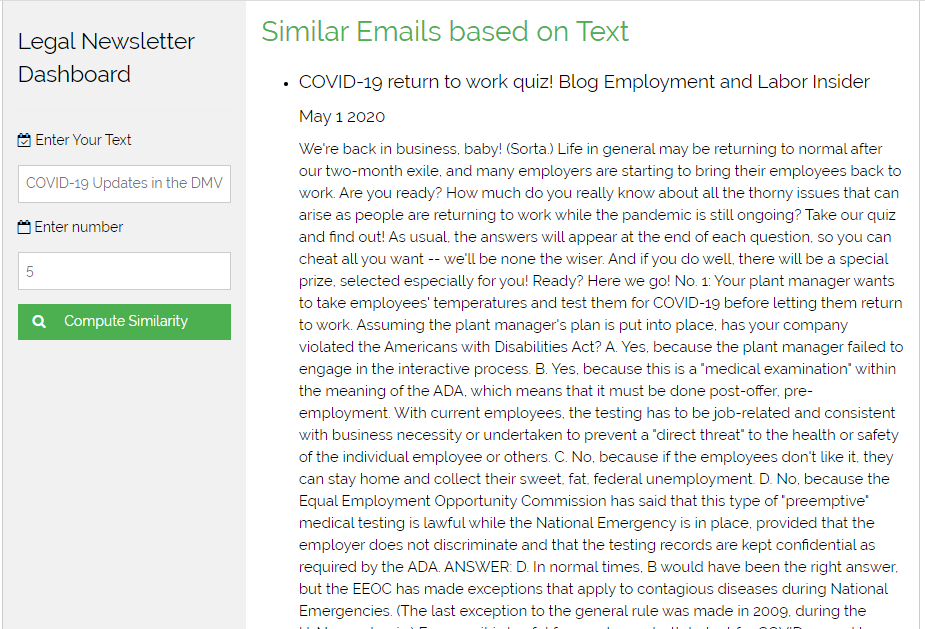

## Legal Newsletter Dashboard 

### Background

As a legal assistant, I review daily trawl for legal research. The trawl consists of 5 comprehensive emails of online legal articles and legal cases short summaries. My job is to review the trawls and decide whether each blurb is relevant to our labor and employment legal scope. My job is to also pinpoint what has already been covered. My intent is to create a tool that will help determine which artcles have already been covered based on a title a text. 

### Objective and Design 

A full stack application that is powered by an word embeddings to decide how closely related articles are from text and title;
-	a web-crawler that collects the text data from the email address 
-	a data pipeline to get the data from the email to the model, prepares the data and compute the emails 
  closeness to the text entry
-	a WordEmbedding model to calculate the distance between text 
- a django app that renders an index.html 
-	a front-end interface that populates the classified summaries  
-	a unit test that ensures that the functions and classes are returning the correct results 

### Python Libraries

-	Pywin32: Data Scraping
-	Luigi: Data pipeline 
-	Word Embedding: Machine learning
-	Django App: User interface
-	W3 School Template: Front-end
-	Pytest: Testing
-	AWS: S3

### Interface 

